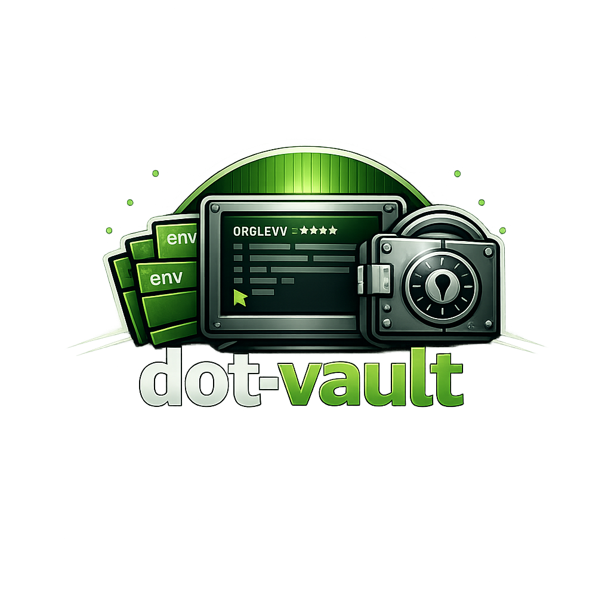

<p align="center">
  
</p>

# dot-vault

`dot-vault` is a Go CLI and terminal UI for managing organization-level `.env` secrets across many repositories. It scans repositories, imports env files into an encrypted Git-friendly store, compares current files against stored versions, creates encrypted backups, and restores secrets when needed.

The project is intended for local operators who want a structured way to keep private `.env` files out of source repositories while still preserving encrypted, incremental history in a location they control.

## Features

- Multi-organization configuration with active organization switching.
- Repository scanning for `.env` and `.env.*` files, with `.gitignore`-aware discovery.
- Per-file encrypted records with per-file data keys and an organization master key.
- Git-friendly store layout for incremental updates and backups.
- CLI workflows for scanning, importing, comparing, backing up, and restoring env files.
- TUI dashboard with filtering, drift status, backup status, timestamps, and first-run setup.
- Touch ID authorization on supported macOS builds, with short-lived sensitive-action sessions.
- Passphrase fallback via `DOT_VAULT_MASTER_PASSPHRASE` when keyring access is unavailable.

## Status

This project is early-stage and under active development. The core CLI/TUI flow is functional, but release packaging, integration tests, and key rotation are still planned.

## Install

Install the latest version directly from the module path:

```sh
go install github.com/teliaz/dot-vault@latest
```

Then run:

```sh
dot-vault --help
dot-vault tui
```

## Run Locally

Clone the repository and run the app from source:

```sh
git clone https://github.com/teliaz/dot-vault.git
cd dot-vault
go run . --help
go run . tui
```

Build a local binary:

```sh
go build -o dot-vault .
./dot-vault tui
```

Run tests:

```sh
go test ./...
```

## First Setup

The fastest path is the TUI:

```sh
dot-vault tui
```

On first run, the setup screen asks for:

- organization name
- repository root, for example `~/repos/org-name`
- encrypted store root, for example `~/secrets/org-name`
- master passphrase used to derive the organization master key

You can also configure an organization from the CLI:

```sh
dot-vault org add \
  --name org-name \
  --repo-root ~/repos/org-name \
  --store-root ~/secrets/org-name
```

Switch the active organization:

```sh
dot-vault org use org-name
```

## Common Commands

Scan repositories and env files:

```sh
dot-vault repo scan
```

Import discovered env files into the encrypted store:

```sh
dot-vault repo import
```

Show drift and backup status:

```sh
dot-vault repo status
```

Compare stored secrets against current env files:

```sh
dot-vault repo compare
```

Create encrypted backup snapshots when content changed:

```sh
dot-vault repo backup
```

Restore one env file directly into a repository:

```sh
dot-vault repo restore --repo my-app --env-file .env
```

## Configuration

By default, configuration is stored under the user config directory. You can override the config path:

```sh
DOT_VAULT_CONFIG=/path/to/config.json dot-vault org list
```

When OS keyring access is unavailable, provide a non-interactive passphrase:

```sh
DOT_VAULT_MASTER_PASSPHRASE='use-a-long-local-passphrase' dot-vault repo import
```

On macOS builds with cgo enabled, sensitive actions use Touch ID when biometric authentication is available. If Touch ID is unavailable, the tool falls back to keyring/passphrase authorization. If Touch ID is available but the prompt is denied or cancelled, the sensitive action fails.

In TUI mode, hidden terminal passphrase prompts are disabled so actions do not freeze the screen. Use first-run setup, press `u` in the dashboard to unlock with a master passphrase, or set `DOT_VAULT_MASTER_PASSPHRASE` for passphrase-backed stores.

## Contributing

Issues and pull requests are welcome. Before submitting a change, run:

```sh
go test ./...
go build ./...
```

Keep changes focused, add tests for behavior changes, and avoid committing plaintext secret files.
